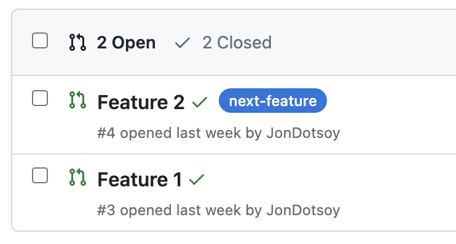
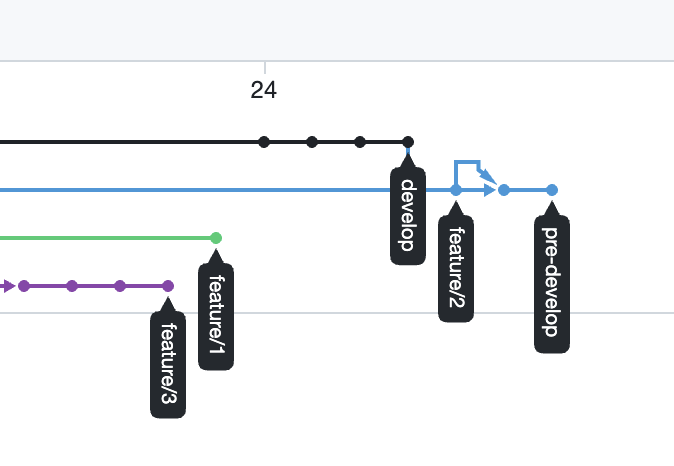

# Feature Branching v2

Automatiza el merge de todos los branch que cuenten con un label asociado.

Automatiza los merge de los cambios previo al lanzamiento en una única rama que
contiene todos los cambios de todos los PR que futuramente puede ser usados para
la rama principal. Evita pasar cambios a la rama de desarrollo si estos nos han
finalizados o requieren mejoras. Ideal si se cuenta con un solo ambiente de
staging anidado a la rama de desarrollo.

**Ventajas:**

- Elimina ceremonias coordinación despliegue a staging
- Fácilmente configurable
- Evita crear cambios revert en las ramas no listas para ser productiva
- Crea filosofía para despliegue usando nomenclatura el los nombres de PRs
- Fácilmente adaptable a trunks base y git flow
- Mantiene historia clara (No require mergear multiples PRs a master)
- Claridad de cambios que pasan a productivo y los que aun no desde el panel de
  GitHub
- Evita multiples PRs anidados
- Destaca conflictos antes de mergear solución, ya que automatiza mensajes de
  alerta.

## Configurar action

1. Crea tu primer archivo action `.github/workflows/feature-branching.yml` con el
   siguiente contenido.

2. Vamos a configurar los eventos `pull_request` y `push` para que se ejecute el
   flujo cuando se asigne o des-asigne una label a la rama base.
   ```yaml
   on:
    workflow_dispatch: {}
    pull_request:
      types:
        - labeled
        - unlabeled
        - synchronize
        - ready_for_review
      branches:
        - develop
    push:
      branches:
        - develop
   ```

3. Vamos a configurar la acción
   [feature-branching](https://github.com/JonDotsoy/feature-branching) donde
   tenemos que definir la rama base y que label se usara para crear la historia
   mesclada. La acción necesita previamente tener todos la historia de git, para
   esto usaremos la acción
   [actions/checkout@v3](https://github.com/actions/checkout)

   > Es necesario configurar la variable de ambiente `GH_TOKEN` para que pueda
   > leer los PR del proyecto.

   ```yaml
   - uses: actions/checkout@v3
     with:
       fetch-depth: 0
   - uses: JonDotsoy/feature-branching@v2
     with:
       base_brach: develop
       label_name_to_merge: next-feature
     env:
       GH_TOKEN: ${{ github.token }}
   ```

4. Crea un PR que este apuntando a la rama base `develop` y a continuación
   asigna el label `next-feature` para que se encargue de crear la historia ya
   combinada.

   

5. Ahora se puede ver en la historia una nueva rama `pre-develop` que une la
   historia principal (`develop`) con los PRs que cuentan con el label
   `next-feature` en una nueva rama.

   

### Ejemplo completo

```yaml
name: feature-branch

on:
  workflow_dispatch: {}
  pull_request:
    types:
      - labeled
      - unlabeled
      - synchronize
      - ready_for_review
    branches:
      - develop
  push:
    branches:
      - develop

permissions:
  contents: write
  pull-requests: write

jobs:
  merge:
    runs-on: ubuntu-latest
    steps:
      - uses: actions/checkout@v3
        with:
          fetch-depth: 0
      - uses: JonDotsoy/feature-branching@v2
        with:
          base_brach: develop
          label_name_to_merge: next-feature
        env:
          GH_TOKEN: ${{ github.token }}
      - run: |
          echo feature-branching.outputs.ref: ${{ steps.feature-branching.outputs.ref	 }}
      - run: |
          echo feature-branching.outputs.changed: ${{ steps.feature-branching.outputs.changed }}
      - run: |
          echo feature-branching.outputs.pr_name: ${{ steps.feature-branching.outputs.pr_name }}
```

## Configuración

|         Input         | Descripción                                                           |
| :-------------------: | :-------------------------------------------------------------------- |
| `label_name_to_merge` | Label que se usara para filtrar los PRs que coincidan                 |
|     `base_brach`      | Nombre de la rama que se usara como base para crear el PR pre-release |
|  `destination_brach`  | Nombre de la rama pre-release                                         |
|   `merge_strategy`    | Describe la estrategia a usar al momento de mergear las ramas. Leer mas en [https://git-scm.com/docs/merge-strategies](https://git-scm.com/docs/merge-strategies) |

## Salida

|  Output   | Descripción                                                                                            |
| :-------: | :----------------------------------------------------------------------------------------------------- |
| `changed` | `true` si existe cambios en la historia, de otro modo retorna `false`                                  |
| `pr_name` | Retorna el valor de `destination_brach` cuenta con historia mergeada de otro modo retorna `base_brach` |
|   `ref`   | Retorna the hash asociado al ultimo commit                                                             |
