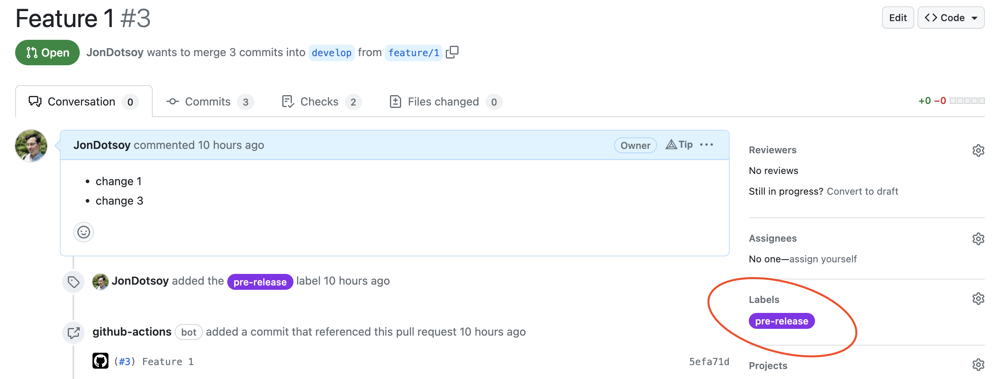
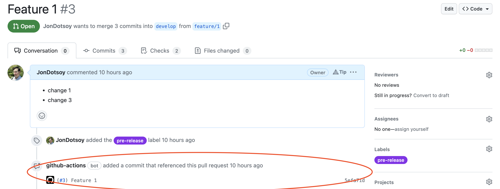
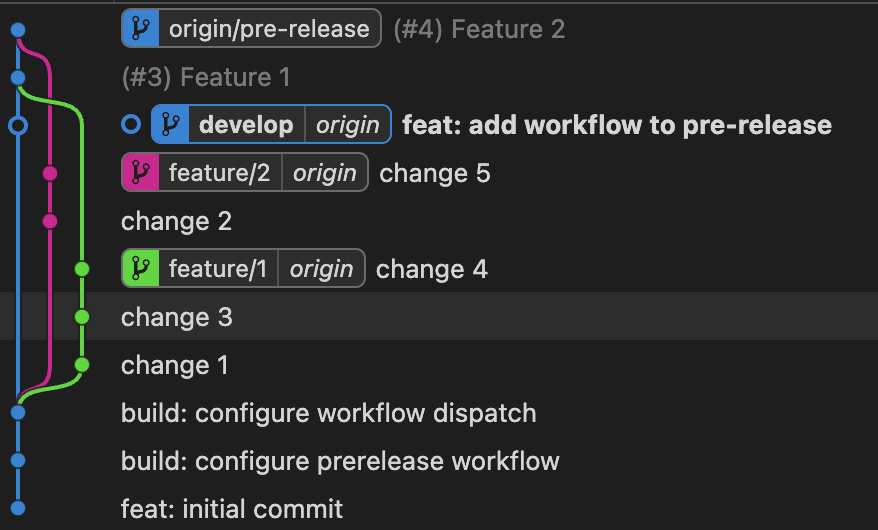

# Feature Branching

Automatiza el merge de todos los branch que cuenten con un label asociado.

Automatiza los merge de los cambios previo al lanzamiento en una única rama que
contiene todos los cambios de todos los PR que futuramente puede ser usados para
la rama principal. Evita pasar cambios a la rama de desarrollo si estos nos han
finalizados o requieren mejoras. Ideal si se cuenta con un solo ambiente de
staging anidado a la rama de desarrollo.

**Ventajas:**

- Elimina ceremonias coordinación despliegue a staging
- Fácilmente configurable
- Evita crear cambios revert en las ramas no listas para ser productiva
- Crea filosofía para despliegue usando nomenclatura el los nombres de PRs
- Fácilmente adaptable a trunks base y git flow
- Mantiene historia clara (No require mergear multiples PRs a master)
- Claridad de cambios que pasan a productivo y los que aun no desde el panel de
  GitHub
- Evita multiples PRs anidados
- Destaca conflictos antes de mergear solución, ya que automatiza mensajes de
  alerta.

## Configurar action

1. Crea tu primer archivo action `.github/workflows/pre-release.yml` con el
   siguiente contenido.

```yaml
name: Prerelease

on:
  workflow_dispatch: {}
  push:
    branches:
      - feature/* # Cualquier rama con prefijo `feature/`
      - develop

permissions:
  contents: write
  pull-requests: write

jobs:
  merge:
    runs-on: ubuntu-latest
    steps:
      - uses: actions/checkout@v3
        with:
          fetch-depth: 0
      - uses: JonDotsoy/feature-branching@v2-preview
        with:
          base_brach: develop
          label_name_to_merge: next-feature
        env:
          GH_TOKEN: ${{ github.token }}
```

2. Crea un PR con un label de nombre `pre-release`.



3. Sube cambios al PR o ejecutar el action prerelease. Esto creara una rama con
   todos los cambios candidatos a pre-release.





## Configuración

|         Input         | Descripción                                                           |
| :-------------------: | :-------------------------------------------------------------------- |
| `label_name_to_merge` | Label que se usara para filtrar los PRs que coincidan                 |
|     `base_brach`      | Nombre de la rama que se usara como base para crear el PR pre-release |
|  `destination_brach`  | Nombre de la rama pre-release                                         |

## Salida

|  Output   | Descripción                                                                                            |
| :-------: | :----------------------------------------------------------------------------------------------------- |
| `changed` | `true` si existe cambios en la historia, de otro modo retorna `false`                                  |
| `pr_name` | Retorna el valor de `destination_brach` cuenta con historia mergeada de otro modo retorna `base_brach` |
|   `ref`   | Retorna the hash asociado al ultimo commit                                                             |
